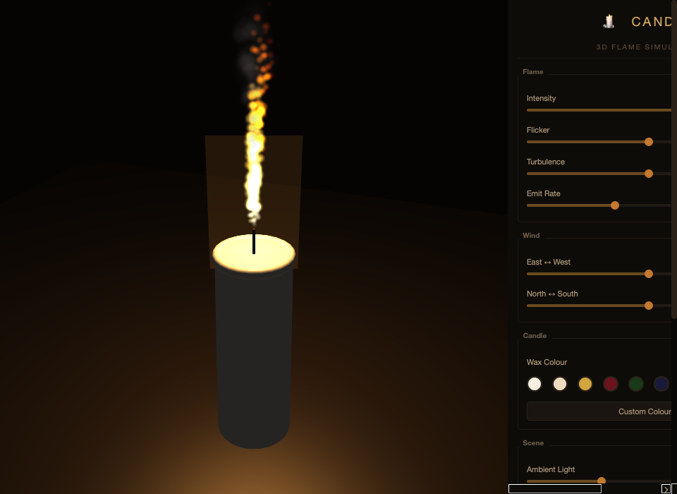
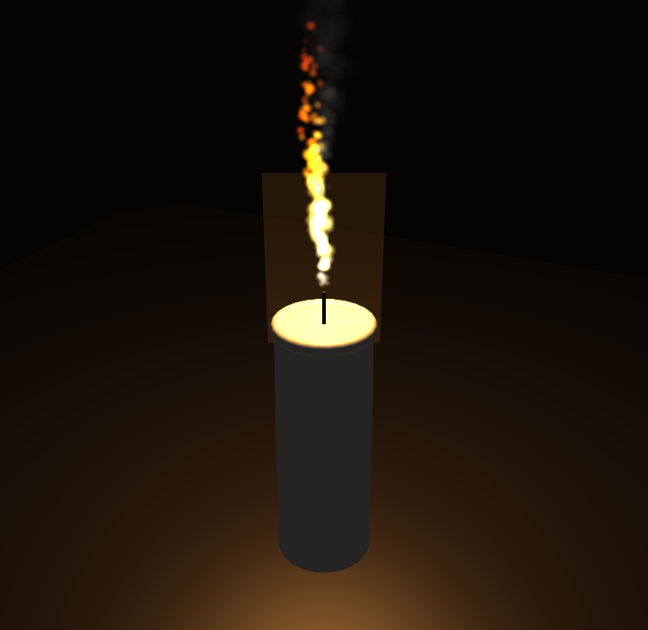
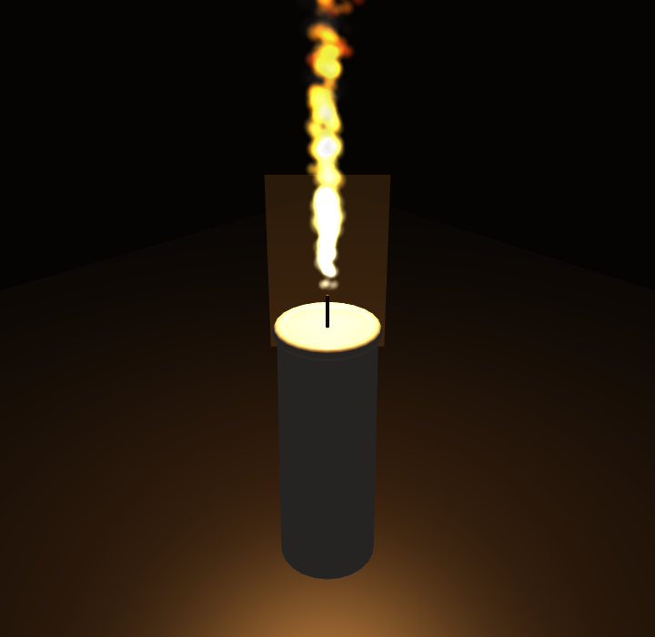
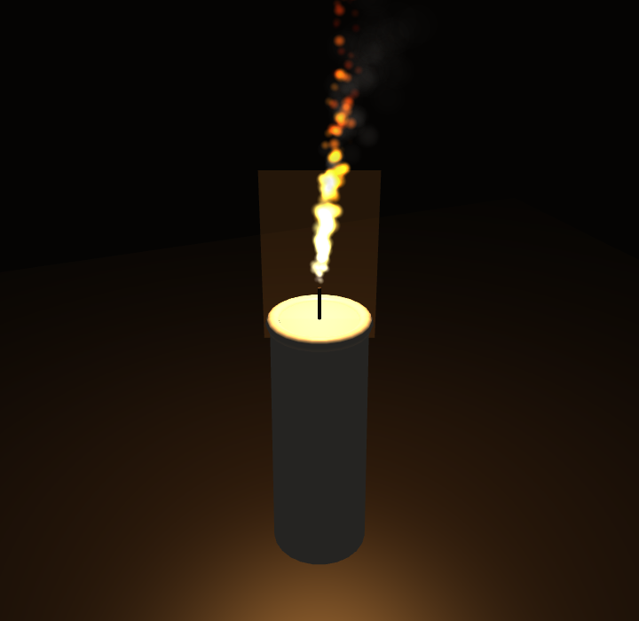
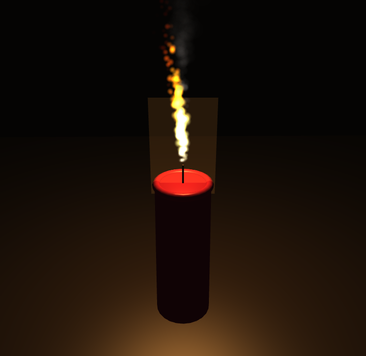

# 🕯️ 3D Candle Flame Simulator

A real-time particle-based candle flame simulation built with Python, OpenGL, and Qt. The flame is rendered using temperature-mapped point sprites with additive blending, driven by a 3D turbulent noise field — producing a physically plausible flickering flame you can orbit around and interact with.




---

## Gallery

| Default Flame | High Intensity | Wind Effect | Burgundy Candle |
|:---:|:---:|:---:|:---:|
|  |  |  |  |

---

## Features

- **800 flame particles** with temperature-based colour ramp (white-blue core → yellow → orange → red)
- **120 smoke particles** with alpha-blend fading above the flame tip
- **3D turbulent noise field** (fractional Brownian motion) driving coherent flame motion
- **Phong-lit candle geometry** — cylinder body, melted wax rim (torus), wick, and table surface
- **Orbit camera** — click-drag to rotate, scroll to zoom, optional auto-rotation
- **Additive-blend glow** billboard behind the flame
- **Multi-frequency flicker** modulating light intensity and particle emission
- **Wind control** — push the flame in any lateral direction
- **10 wax colour presets** plus a custom colour picker
- **Dark amber UI** with grouped sliders, checkboxes, and action buttons

---

## Installation

### Requirements

- Python 3.10+
- OpenGL 2.1+ capable GPU

### Dependencies

```bash
pip install PyQt5 PyOpenGL numpy
```

On macOS with conda:

```bash
conda install pyqt numpy
pip install PyOpenGL
```

---

## Usage

From the project root directory:

```bash
# Option 1: module invocation
python -m candle

# Option 2: launcher script
python run_candle.py
```

### Controls

| Input | Action |
|---|---|
| Left-drag | Orbit camera |
| Scroll wheel | Zoom in/out |
| Intensity slider | Flame size and brightness (0–100%) |
| Flicker slider | Brightness variation amount |
| Turbulence slider | Noise field perturbation strength |
| Emit Rate slider | Particles spawned per frame |
| Wind E↔W / N↔S | Lateral wind direction and strength |
| Wax colour swatches | 10 presets (Ivory, Honey, Burgundy, etc.) |
| Custom Colour… | System colour picker |
| Ambient Light | Scene base illumination |
| Auto-Rotate | Slow orbit when not dragging |
| Show Smoke | Toggle smoke particle rendering |
| Pause / Resume | Freeze particle simulation |
| Blow Out | Set intensity to zero |
| Screenshot | Save current frame as PNG/JPEG |

---

## Project Structure

```
candle_app/
├── run_candle.py              ← convenience launcher
└── candle/
    ├── __init__.py            ← package marker + version
    ├── __main__.py            ← python -m candle entry
    │
    │  ── Pure logic (no Qt/GL) ──
    ├── noise.py               ← 3D value noise + fBm (vectorised numpy)
    ├── particles.py           ← FlameSystem, SmokeSystem, FlameParams
    ├── camera.py              ← OrbitCamera, perspective(), look-at matrix
    ├── geometry.py            ← Procedural meshes: cylinder, torus, plane
    │
    │  ── OpenGL ──
    ├── shaders.py             ← GLSL 1.20 sources (Phong, Flame, Smoke, Glow)
    ├── renderer.py            ← Shader compilation, VBO management, draw calls
    │
    │  ── Qt UI ──
    ├── canvas.py              ← QOpenGLWidget (timer, mouse orbit, particle loop)
    ├── controls.py            ← Side panel (sliders, swatches, checkboxes)
    ├── main_window.py         ← QMainWindow assembling canvas + panel
    └── app.py                 ← QApplication, dark theme, OpenGL config, main()
```

Dependency flow is strictly one-directional:

```
app → main_window → canvas → renderer → shaders
                  → controls    ↓
                       ↓     geometry
                   particles → noise
                    camera
```

---

## Architecture

### Particle Physics (`particles.py`, `noise.py`)

**FlameSystem** manages 800 particle slots in flat numpy arrays (`pos`, `vel`, `life`, `max_life`, `temp`, `size`). Each frame:

1. **Emit** — dead slots are recycled; new particles spawn at the wick origin with radial spread, upward velocity scaled by intensity, and initial temperature near 1.0
2. **Turbulence** — a 3D fBm noise field (`noise.py`) generates coherent lateral and vertical perturbations. The field scrolls over time to create evolving turbulent motion
3. **Wind** — lateral forces scale with particle height (taller = more wind influence)
4. **Cohesion** — particles below y=0.15 are pulled toward the centre axis, forming the tapered flame base
5. **Cooling** — temperature decays each frame, accelerated for particles far from centre (edge cooling)
6. **Size curve** — particles grow during their first 20% of life, then shrink

**SmokeSystem** uses the same array structure but with simpler physics: slow upward drift, wind influence, and size growth with age.

### Noise Field (`noise.py`)

A custom 3D value noise implementation:

- **Hash function** — integer lattice coordinates hashed to pseudorandom floats via large-prime multiplication
- **Trilinear interpolation** — Hermite smoothstep between 8 lattice corners
- **fBm** — 3 octaves with amplitude decay (0.5×) and frequency growth (2.1×)

All operations are fully vectorised over numpy arrays, so an entire particle batch is perturbed in a single call.

### Rendering (`renderer.py`, `shaders.py`)

Four GLSL 1.20 shader programs:

| Program | Geometry | Blending | Purpose |
|---|---|---|---|
| **Phong** | Indexed triangles | Opaque | Candle body, rim, wick, table |
| **Flame** | Point sprites | Additive (`SRC_ALPHA, ONE`) | Temperature-mapped flame particles |
| **Smoke** | Point sprites | Normal (`SRC_ALPHA, ONE_MINUS_SRC_ALPHA`) | Fading grey smoke wisps |
| **Glow** | Billboard quad | Additive | Warm halo behind the flame |

**Flame fragment shader** colour ramp:

| Temperature | Colour |
|---|---|
| > 0.8 | White → blue-white (hot core) |
| 0.5 – 0.8 | Orange → bright yellow |
| 0.2 – 0.5 | Red-orange → orange |
| < 0.2 | Dark red → red-orange (fading tip) |

Static geometry (candle meshes) is uploaded once to `GL_STATIC_DRAW` VBOs. Particle data is re-uploaded each frame to `GL_DYNAMIC_DRAW` VBOs.

### Camera (`camera.py`)

Spherical-coordinate orbit camera:

- **Theta** — horizontal angle (mouse drag X or auto-rotation)
- **Phi** — vertical angle from pole (mouse drag Y, clamped to avoid gimbal lock)
- **Distance** — scroll wheel (clamped 0.4–3.5)
- **Target** — fixed at y=0.22 (flame centre)

The look-at matrix is computed in row-major numpy and transposed for GL column-major upload.

### Flicker System (`canvas.py`)

Multi-frequency sinusoidal flicker with a random component:

```
flicker = sin(t × 0.008) × 0.1
        + sin(t × 0.019) × 0.07
        + sin(t × 0.037) × 0.05
        + random(-0.075, 0.075)
```

This modulates both the point-light intensity (affecting Phong shading on the candle body) and the particle emission rate, creating coupled brightness/density variation.

---

## Performance

Typical performance on a modern system:

| Metric | Value |
|---|---|
| Flame particles | 800 max (pool) |
| Smoke particles | 120 max (pool) |
| Physics step | ~1.2 ms |
| Target framerate | 60 fps |
| Shader programs | 4 (compiled once) |
| VBO uploads/frame | 9 dynamic + 1 static |

---

## Customisation

### Adding wax colours

Edit the `CANDLE_COLORS` dict in `controls.py`:

```python
CANDLE_COLORS["Ocean"] = (0.15, 0.35, 0.55)
```

### Adjusting flame shape

Key parameters in `FlameParams` (`particles.py`):

```python
@dataclass
class FlameParams:
    intensity:      float = 0.7     # flame vigour
    turbulence:     float = 0.5     # noise perturbation
    flicker:        float = 0.5     # brightness variation
    emit_rate:      float = 12.0    # particles/frame
    max_particles:  int   = 800     # flame pool size
    max_smoke:      int   = 120     # smoke pool size
```

### Modifying the colour ramp

Edit the temperature thresholds and `mix()` endpoints in `FLAME_F` inside `shaders.py`.

---

## Screenshots

Click the **Screenshot** button in the Actions panel to save the current frame as a PNG or JPEG via a file dialog. You can also capture programmatically:

```python
canvas.screenshot("/path/to/output.png")
```

To regenerate the gallery images, run the included script:

```bash
python candle/take_screenshots.py
```

This launches the simulator, cycles through several configurations, and saves five screenshots to `candle/screenshots/`.

---

## Troubleshooting

| Issue | Solution |
|---|---|
| `ShaderValidationError` on macOS | Ensure `validate=False` is passed to `compileProgram()` in `renderer.py` |
| `Segoe UI` font warning on macOS | The stylesheet uses `-apple-system` as the primary font; this warning is harmless |
| Black screen, no flame | Check that your GPU supports OpenGL 2.1+ and point sprites |
| Low framerate | Reduce `max_particles` in `FlameParams` or lower `emit_rate` |
| `ModuleNotFoundError: PyOpenGL` | `pip install PyOpenGL` (not `OpenGL`) |

---

## License

MIT
